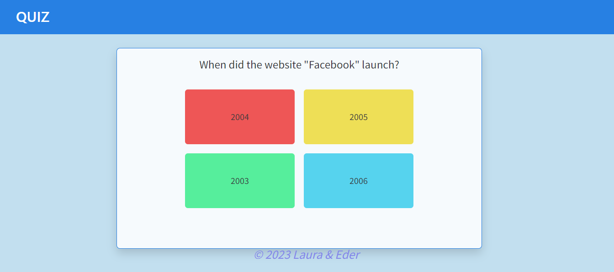
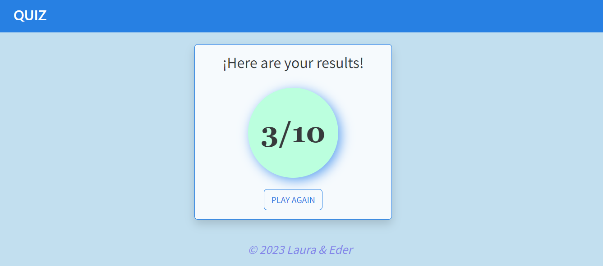

<h1 align="center"> QUIZ </h1>
 

   
 

 ### Índice
 - [Descripción del proyecto](#descripción-del-proyecto)
 - [Funcionalidades del proyecto](#:hammer:Funcionalidades-del-proyecto)
 - [Tecnologías utilizadas](#tecnologías-utilizadas)
 - [Autores](#Autores)

## Descripción del proyecto
***Este proyecto es un cuestionario de entretenimiento, también conocido como Quiz,
capaz de mostrar los resultados erróneos y correctos.*** 

- El Quiz constará de 10 preguntas. Cada pregunta tendrá 4 opciones y
sólo una de ellas será la correcta.
- Terminado el quiz se mostrarán los resultados.

## :hammer:Funcionalidades del proyecto
- `Pagina 1`: Empezar el quiz pulsando start.
- `pagina 2`: En la segunda pagina comenzara el quiz , deberas responder todas las preguntas aleatorias hasta que termine automaticamente.
- `pagina 3`: Ya terminado el test, aparecera una ultima pantalla con el resultado del quiz.

## Tecnologías utilizadas

## Autores
 BY [EderJulian](https://github.com/EderJulian) AND [LauraGarciaa](https://github.com/LauraGarciaa) :slightly_smiling_face:

